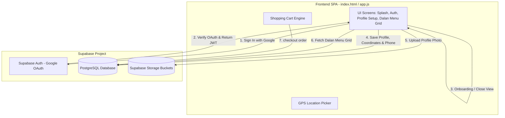

# Dalan - Exclusive Single-Vendor Restaurant Storefront

Dalan is a dedicated, high-end single-vendor culinary storefront for a standalone restaurant, tailored for direct sales to customers. Built using modern client-side frontend architectures and a Supabase backend database, it features native Google OAuth sign-in, coordinate delivery tracking, and a dynamic menu layout.

---

## 1. Storefront System Architecture



---

## 2. Supabase Setup Guide

To configure the application with your live Supabase project:

### Phase 1: Database Tables & Seed
1. Open your **Supabase Workspace Dashboard**.
2. Navigate to the **SQL Editor** tab.
3. Copy the SQL script from [supabase/schema.sql](file:///d:/dalan/supabase/schema.sql) and run it to create tables (`profiles`, `dalan_menu`, `orders`, `order_items`), security triggers, and policies.
4. Copy the SQL script from [supabase/seed.sql](file:///d:/dalan/supabase/seed.sql) and run it to seed Dalan's kitchen items (Momo, Platters, Beverages, Desserts).

### Phase 2: Google OAuth Provider Setup
To enable Gmail login:
1. Go to the **Google Cloud Console** (https://console.cloud.google.com).
2. Create a project, navigate to **APIs & Services > OAuth consent screen**, configure external user types, and set up your consent screen.
3. Go to **Credentials**, click **Create Credentials > OAuth client ID**, and select **Web application**.
4. In your **Supabase Dashboard**, navigate to **Authentication > Providers > Google** and copy the **Callback URL**.
5. Return to the Google Cloud Console client ID setup, add the Callback URL to the **Authorized redirect URIs** section, and click **Create**.
6. Copy the generated **Client ID** and **Client Secret**.
7. Paste these keys into the Google provider fields in the Supabase Dashboard, toggle it to **Enabled**, and save.

### Phase 3: Avatars Storage Bucket
1. Navigate to **Storage** in the sidebar.
2. Create a public bucket named `profile-photos`.
3. Row-level security (RLS) is pre-configured in `schema.sql` to restrict write permissions to the avatar file owner.

---

## 3. Database Schema Reference

The single-vendor backend is structured across 4 main tables:

| Table | Purpose | Security Rule |
| :--- | :--- | :--- |
| `profiles` | User profiles linking full name, email, addresses, coordinates, and avatar URLs to `auth.users`. | Public read. Writes restricted to account owners (`auth.uid() = id`). |
| `dalan_menu` | Catalog containing dish name, description, category (Momo, Traditional Platters, Beverages, Desserts), price in NPR, rating, and availability. | Public read-only for all guests. Writes admin-restricted. |
| `orders` | Completed checkouts tracking delivery status, total amount, coordinates, and address. | Viewable and creatable only by ordering user (`auth.uid() = user_id`). |
| `order_items` | Individual line items within an order referencing `dalan_menu(id)` and quantity. | Viewable and creatable only by ordering user. |

---

## 4. Local Deployment

Serve the files locally from your project directory `d:\dalan` using a local server utility:

### Serving via Python
```bash
python -m http.server 9000
```
Navigate to `http://localhost:9000` in your web browser.

### Serving via Node.js
```bash
npx http-server ./ -p 9000
```
Navigate to `http://localhost:9000`.

---

## 5. Integrating Supabase Client SDK

The Supabase configurations are set at the top of your [assets/js/app.js](file:///d:/dalan/assets/js/app.js):
```javascript
const SUPABASE_URL = "https://iobpvspmmjrrvixnmjth.supabase.co";
const SUPABASE_ANON_KEY = "sb_publishable_Uzeynpiw4AQQVnHSP_15Xw_awXtAciE";
```
If these values are defined, the app automatically switches from local mock mode to active API bindings.
